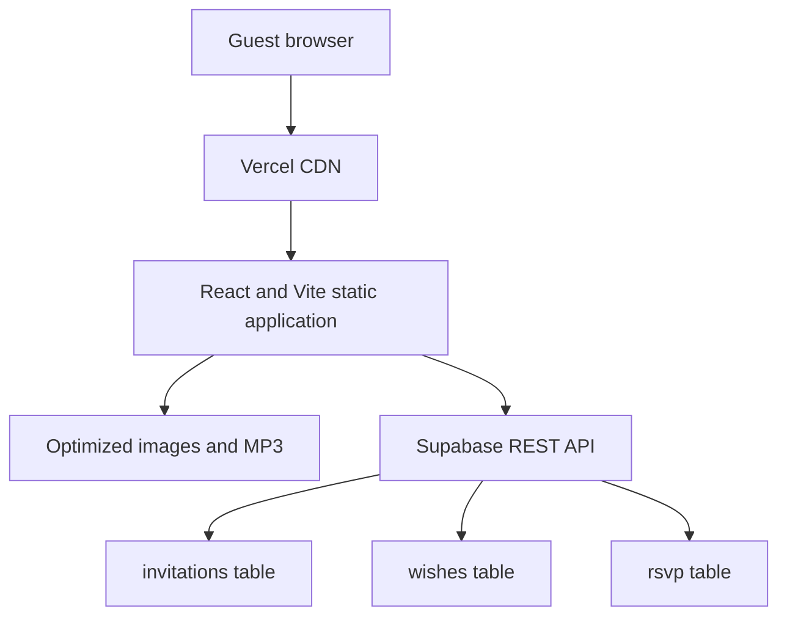

# Invitation Mahogany Color

A responsive digital wedding invitation for **Alfa & Rizaldy**, built with React, Vite, Tailwind CSS, Framer Motion, and Supabase.

## Main features

- Personalized cover using a `?to=Guest+Name` URL parameter.
- Responsive photo backgrounds with a mahogany gradient.
- Wedding countdown and event schedule.
- Shared Google Maps event location.
- Couple profile and love story.
- Responsive masonry photo gallery with fullscreen popup.
- RSVP form stored in Supabase.
- Wishes & Prayers guestbook stored in Supabase.
- Data separation through `invitation_slug=alfa-rizaldy`.
- Digital Mandiri wedding-gift card with copy button.
- Background music and music controls.
- Lightweight client-side honeypot protection.

## Architecture



Vercel serves static files through its CDN. Supabase handles only invitation metadata, Wishes, and RSVP records. Browsers do not connect directly to PostgreSQL; they use Supabase's REST API.

## Database partitioning

Every Wish and RSVP includes:

```text
invitation_slug = alfa-rizaldy
```

The application also filters Wishes by that slug. This prevents accidental mixing between invitations. Because the slug and publishable key are public frontend values, strict security must still be enforced by Supabase Row Level Security policies.

## Anti-spam and validation

Current protection includes:

- required fields;
- trimming whitespace before insert;
- name limit of 100 characters;
- Wish limit of 1,000 characters;
- guest count limited to 1–10 in the UI;
- hidden honeypot fields in Wishes and RSVP;
- submission locks that stop rapid duplicate requests;
- disabled buttons while requests are in flight;
- generic error messages that do not expose backend details;
- React text escaping to prevent stored HTML from executing.

The honeypot blocks simple form-filling bots only. It does not stop an attacker from calling Supabase directly. Public deployments that receive abuse should add server-side rate limiting and Cloudflare Turnstile through a Vercel Function or Supabase Edge Function.

## Environment variables

Copy `.env.example` to `.env.local` and set:

```text
VITE_SUPABASE_URL
VITE_SUPABASE_PUBLISHABLE_KEY
VITE_INVITATION_SLUG
```

Never expose a Supabase `service_role` key in this frontend.

## Development

```bash
npm install
npm run dev
```

Production build:

```bash
npm run build
```

## Automated tests

Run the React test suite:

```bash
npm test
```

Watch mode:

```bash
npm run test:watch
```

Run unit tests followed by the production build:

```bash
npm run test:all
```

The component suite mocks Supabase completely. It cannot insert data into production.

## Read-only security test

Prefer a staging Supabase project:

```bash
npm run test:security -- \
  --supabase-url https://your-staging-project.supabase.co \
  --anon-key YOUR_STAGING_PUBLISHABLE_KEY \
  --slug autotest-alfa-rizaldy
```

Production is refused unless read-only access is explicitly acknowledged:

```bash
npm run test:security -- \
  --supabase-url https://your-project.supabase.co \
  --anon-key YOUR_PUBLISHABLE_KEY \
  --slug alfa-rizaldy \
  --allow-production-read
```

This test sends only HTTP `GET` requests. It checks invitation availability, Wish filtering, unknown-slug behavior, and anonymous RSVP privacy.

## Supabase SQL security audit

Open Supabase SQL Editor and run:

```text
tests/security/supabase_security_audit.sql
```

The script is read-only. It inventories RLS, policies, grants, indexes, foreign keys, validation constraints, and invalid-row counts.

## Load test: 200 simultaneous visitors

The load runner is deliberately read-only and supports both the deployed website and Supabase.

Test a deployed page:

```bash
npm run test:load -- \
  --page-url https://your-invitation.vercel.app \
  --users 200
```

Test Supabase Wish reads:

```bash
npm run test:load -- \
  --supabase-url https://your-staging-project.supabase.co \
  --anon-key YOUR_STAGING_PUBLISHABLE_KEY \
  --slug autotest-alfa-rizaldy \
  --users 200
```

For an explicitly approved production read test, add:

```text
--allow-production-read
```

Default acceptance thresholds:

- no more than 1% failed requests;
- p95 latency no more than 2,000 ms;
- at most 50 Wishes returned per request;
- every returned Wish must match the requested invitation slug.

The runner reports status codes, throughput, transferred bytes, mean latency, p50, p95, and p99.

## Recommended release checklist

1. Run `npm test`.
2. Run `npm run build`.
3. Run the read-only REST security test.
4. Run `tests/security/supabase_security_audit.sql` in Supabase.
5. Confirm anonymous users cannot read RSVP rows.
6. Confirm anonymous users cannot update or delete Wishes/RSVP.
7. Test Wishes and RSVP once manually.
8. Run the 200-user read test against staging.
9. Check Vercel and Supabase usage/logs.
10. Back up RSVP data before the event.

More details are available in [`tests/README.md`](tests/README.md).
